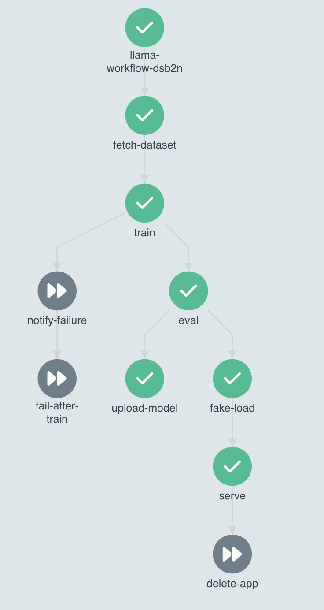
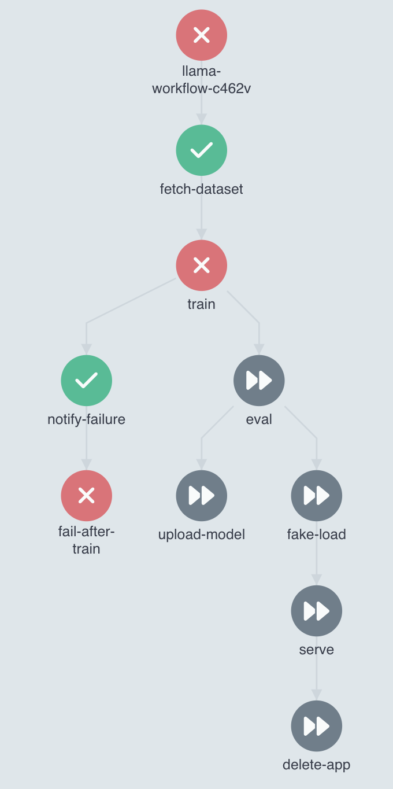
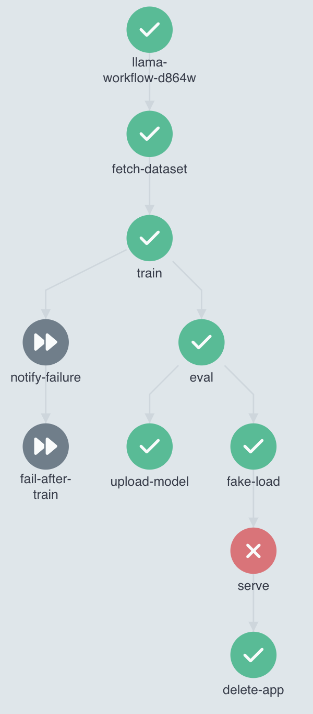

# Task 2 - Deploy llama with argocd

## Selected tools
* [ArgoCD](https://argo-cd.readthedocs.io/en/stable/) - CI for infrastructure apps from git repo
* [Argo Workflows](https://argo-workflows.readthedocs.io/en/latest/) - automated pipelines for ML
* [Fluentd](https://docs.fluentd.org/) - log aggregation
* [Kustomization](https://kubernetes.io/docs/tasks/manage-kubernetes-objects/kustomization/) - configuration for k8s resources
* [Helm](https://helm.sh/docs/) - deployment of the main serve application with a chart
* [GitHub actions](https://docs.github.com/en/actions) (technically) - CI for actual apps, can be any other tool, e.g. Jenkins

## Main assumptions
* Ingresses are supposed to work only with my local setup due to custom proxy and SSL/TLS setup. On another setup, host paths must be changed to reflect actual setup.
* NFS mounts refer to a local truenas server.
* Security is of secondary matter. RBAC-related configs and user/groups for container executions are minimal but not as restrictive as they should be.
* A lot of configuration of ArgoCD and Argo Workflows is set up to quickest deployment possible. In normal conditions, configs should be specified as per-cluster-reqs.
* Helm charts used for ArgoCD Apps are fixed - ArgoCD does not manage it's parameters. However, it is possible to specify chart values while preparing Application descriptor.
* ML applications **aren't** actual ML applications. They just imitate required behavior. If required, I can explain, how does it look like in Tensorflow
* For CD testing, [gh repo](https://github.com/phajder/llama-argocd) was created.

## Architecture


## Prerequisites
1. Prepare [ArgoCD deployment](./infra/argocd/) with Kustomization.
2. Prepare [Argo Workflows](./infra/argo-workflows/), optionally with Kustomization (for local testing purposes).
3. Prepare [Fluentd](./infra/fluentd/) configuration for log aggregation. Actual configuration was prepared after setting all of the ArgoCD Apps.

## Bootstrap
The bootstrapping script assumes that there is no ArgoCD in the cluster.

1. Bootstrap k3s cluster using any provider. In this case, it was created in task 1.
2. Execute provided [boostrap](./bootstrap.sh) script
```bash
chmod u+x ./bootstrap.sh
./bootstrap.sh
```

_Note: bootstrapping script does not install fluentd (yet). That's because (at this stage of my work) still needs proper setup, according to the future workflows._

After initial bootstrap it is possible to manage ArgoCD and other tools using ArgoCD itself. More info [here](https://argo-cd.readthedocs.io/en/stable/operator-manual/declarative-setup/#manage-argo-cd-using-argo-cd).

## Preparation of (other) ArgoCD Applications
In this task, the [app of apps pattern](https://argo-cd.readthedocs.io/en/stable/operator-manual/cluster-bootstrapping/) for initial cluster setup (after initial bootstrap) was used.

Besides previously described apps (ArgoCD and Argo Workflows) there is two more Apps: [Workflow Templates](./infra/workflow-templates/) and [App-of-Apps app](./infra/app-of-apps/). After ArgoCD deployment it is possible to deploy other ones using only App-of-Apps app, like in [bootstrap script](./bootstrap.sh#L04). All of the apps will be synced after any push to the git repo, according to specified paths in Applications.

## Modifications of the (main) serve app chart
Helm chart prepared in [task 1](/task-1/README.md) was used to deploy main application. There are few changes, mainly related to scaling the application using [Deployment controller](./infra/llama-serve/templates/deployment.yaml). Due to the fact, that on my infrastructure there is only one GPU without MIG support, there is also small change to [_resources_ section](./infra/llama-serve/templates/deployment.yaml#L29) in container specs and related env variables.

## Preparation of ML applications
This repo's destiny is to serve only infrastructure configuration. The actual code of the applications is in separate repo. Or should be in normal case - for readability everything is stored in a single repo. This follows [ArgoCD good practices](https://argo-cd.readthedocs.io/en/stable/user-guide/best_practices/#separating-config-vs-source-code-repositories). More detailed description is provided in app readme.

## Workflow templates
For pipeline execution, ArgoCD workflows were selected. In order to prepare requested pipeline, several WorkflowTemplates were created. All of them are in [workflow-templates directory](./infra/workflow-templates/). To skip the requirement for pushing diffs to the repo, [Kustomization file](./infra/workflow-templates/kustomization.yaml) was prepared. There are 8 workflow templates:
1. [Fetch-dataset](./infra/workflow-templates/fetch-dataset.yaml) - fetches dataset specified as input to this task. NFS share was used for this purpose.
2. [Train](./infra/workflow-templates/train.yaml) - trains the model, using dataset fetched to the local hostPath, producting checkpoints to hostPath volume. In this way, checkpoint is not sent via network. It is important to remember this assumption in multi-node cluster, [creating valid PV](https://stackoverflow.com/questions/67345577/can-we-connect-multiple-pods-to-the-same-pvc) for sharing content between two stages.
3. [Notify-failure](./infra/workflow-templates/notify-failure.yaml) - if training fails, notification to discord server is sent. In normal cases, [Argo Events](https://argoproj.github.io/argo-events/) can be used but I had some problems with deploying event bus and the events were not working at all.
4. [Eval](./infra/workflow-templates/eval.yaml) - evaluates the model. Takes checkpoints as input from local hostPath and produces exported model, which is then shared to the load stage and simultaneously uploaded to NFS share.
5. [Fake-load](./infra/workflow-templates/fake-load.yaml) - loads the model from previous step, shared by local hostPah. This step is useless in normal pipelines, but is used to show that proper model is selected (it actually simplify deployment of the final app).
6. [Upload-model](./infra/workflow-templates/upload-model.yaml) - uploads model from local hostPath to NFS share. This process occurs at the same time as model loading (or serving in natuarl cases).
7. [Serve](./infra/workflow-templates/serve.yaml) - created ArgoCD Application from [helm chart](./infra/llama-serve/). In production cases, [Argo Rollouts](https://argoproj.github.io/argo-rollouts/) can be used, but I wouldn't like to over-engineer that example too much (no more than it is). (-:
7. [LLama-workflow](./infra/workflow-templates/llama-workflow.yaml) - main workflow template, containing actual pipeline and its configuration.

## Discord webhook secret
Because notification requires discord webhook, a secret was created in following order:
1. Generate webhook on discord server.
2. Copy the webhook part, without host and api parts.
3. Generate base64 encoding:
    ```bash
    echo "discord_webhook" | base64
    ```
4. Prepare Secret descriptor
    ```yaml
    apiVersion: v1
    kind: Secret
    metadata:
      name: notify-secret
      namespace: argo
    data:
      webhook: <base64_webhook>
    ```
5. Apply Secret do the cluster.
    ```bash
    kubectl apply -f discord-webhook.yaml
    ```
## Actual Workflow file
At the end, the actual [workflow file](./workflow.yaml) is prepared. It consists of main workflow arguments and reference to workflow template. All of the referenced templates must be available on Argo Workflow server.

## Workflow usage
To execute a pipeline, following command can be used:
```bash
argo submit -n argo --watch --serviceaccount argo workflow.yaml
```

To access argo dashboard:
```bash
kubectl -n argo port-forward service/argo-server 2746:2746
```

## Possible workflow states
There are three possible final states of the workflow: 

### Training successfully performed
Training performed successfully, so model is evaluated from trained checkpoint. Then, model is loaded and deployed in the cluster.



### Training failed
Training failed. Devs are informed via notification on Discord. If I hadn't had problems with even bus, I would use Argo Events, as described previously.



### Deployment failed
This is actually undesirable, because argocd app cannot be created without being previously deleted. However, this was done for testing purposes. It automatically deleted this App after failed creation. In production, I would use Argo Rollouts, as described previously.


